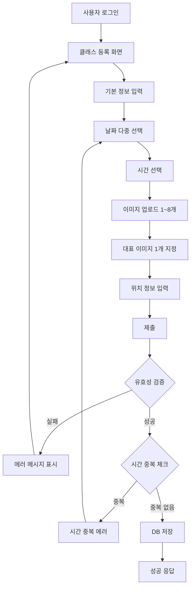

# PRD: 클래스 등록 기능

**작성일**: 2025-01-14  
**작성자**: zionge2k  
**브랜치**: `40-feature-register-class`  
**상태**: 📝 Draft

---

## 📋 목차

1. [개요](#1-개요)
2. [비즈니스 요구사항](#2-비즈니스-요구사항)
3. [기능 명세](#3-기능-명세)
4. [데이터 모델](#4-데이터-모델)
5. [API 명세](#5-api-명세)
6. [유효성 검증 규칙](#6-유효성-검증-규칙)
7. [에러 처리](#7-에러-처리)
8. [제약사항 및 비즈니스 규칙](#8-제약사항-및-비즈니스-규칙)
9. [구현 범위](#9-구현-범위)
10. [향후 확장 계획](#10-향후-확장-계획)

---

## 1. 개요

### 1.1 목적

사용자가 자신이 진행할 클래스(강의)를 시스템에 등록하여, 다른 사용자들이 예약할 수 있도록 하는 기능입니다.

### 1.2 주요 특징

- **다중 날짜 선택**: 같은 강의를 여러 날짜에 한 번에 등록 가능
- **시간 중복 방지**: 같은 강사가 동일 시간에 여러 클래스 등록 불가
- **이미지 관리**: 최소 1개, 최대 8개의 이미지 등록 (대표 이미지 1개 필수)
- **위치 정보**: 주소, 좌표, 우편번호 저장 (추후 Kakao Map API 연동 예정)

### 1.3 사용자

- **대상**: 모든 인증된 사용자 (Role 구분 없음)
- **권한**: 로그인한 모든 사용자가 클래스 등록 가능
- **비고**: 시스템 내 모든 사용자는 학생이자 선생님이 될 수 있음

---

## 2. 비즈니스 요구사항

### 2.1 핵심 요구사항

| 요구사항 | 설명 | 우선순위 |
|---------|------|---------|
| 다중 날짜 등록 | 같은 강의를 여러 날짜에 한 번에 등록 | ⭐⭐⭐ |
| 시간 중복 방지 | 같은 강사의 시간 충돌 체크 | ⭐⭐⭐ |
| 이미지 관리 | 최소 1개, 최대 8개, 대표 이미지 1개 | ⭐⭐⭐ |
| 위치 정보 저장 | 주소, 좌표, 우편번호 저장 | ⭐⭐ |
| 카테고리 분류 | 미리 정의된 카테고리로 분류 | ⭐⭐ |

### 2.2 비즈니스 시나리오

#### 시나리오 1: 기본 클래스 등록

```
사용자가 "홈 베이킹 클래스"를 다음과 같이 등록:
- 날짜: 2025-01-20, 2025-01-22, 2025-01-24
- 시간: 14:00 ~ 16:00
- 결과: 3개의 Times 레코드 생성 (같은 Classes에 연결)
```

#### 시나리오 2: 같은 날짜, 다른 시간

```
사용자가 같은 날짜에 다른 시간대의 클래스를 추가로 등록하고 싶은 경우:
1. 첫 번째 등록: 2025-01-20, 14:00~16:00 (베이킹 기초)
2. 두 번째 등록: 2025-01-20, 18:00~20:00 (베이킹 심화)
→ 별도의 API 호출로 새로운 클래스 생성
```

#### 시나리오 3: 시간 중복 방지

```
사용자가 이미 등록한 시간과 겹치는 클래스 등록 시도:
- 기존: 2025-01-20, 14:00~16:00
- 시도: 2025-01-20, 15:00~17:00 (1시간 겹침)
→ 409 Conflict 에러 발생
```

---

## 3. 기능 명세

### 3.1 클래스 등록 프로세스



### 3.2 입력 항목

#### 필수 입력 항목

| 필드 | 타입 | 제약조건 | 설명 |
|-----|------|---------|------|
| `className` | String | max=50, not blank | 클래스명 |
| `category` | Enum | not null | 카테고리 (고정 목록) |
| `maxCapacity` | Integer | min=1, not null | 최대 수용 인원 |
| `price` | Integer | min=0, not null | 가격 (원) |
| `dates` | List\<LocalDate\> | not empty, future | 날짜 목록 (다중 선택) |
| `startTime` | LocalTime | not null | 시작 시간 |
| `endTime` | LocalTime | not null | 종료 시간 |
| `images` | List\<ImageRequest\> | 1~8개 | 이미지 목록 |

#### 선택 입력 항목

| 필드 | 타입 | 제약조건 | 설명 |
|-----|------|---------|------|
| `classDetail` | String | max=255 | 클래스 상세 설명 |
| `curriculum` | String | max=255 | 커리큘럼 |
| `included` | String | max=255 | 포함 사항 |
| `required` | String | max=255 | 준비물 |
| `location` | String | max=255 | 주소 |
| `longitude` | String | max=20 | 경도 |
| `latitude` | String | max=20 | 위도 |
| `zipcode` | String | max=10 | 우편번호 |

#### 이미지 정보

| 필드 | 타입 | 제약조건 | 설명 |
|-----|------|---------|------|
| `imageUrl` | String | not blank | 이미지 URL (로컬 서버 경로) |
| `isRepresentative` | Boolean | - | 대표 이미지 여부 (정확히 1개만 true) |

### 3.3 카테고리 목록 (Enum)

```java
public enum CategoryType {
    COOKING("요리"),
    BAKING("베이킹"),
    ART("미술"),
    MUSIC("음악"),
    SPORTS("운동"),
    DANCE("댄스"),
    LANGUAGE("언어"),
    IT("IT/프로그래밍"),
    PHOTO("사진"),
    CRAFTS("공예");
}
```

---

## 4. 데이터 모델

### 4.1 ERD

```
┌─────────────────┐
│     Users       │
├─────────────────┤
│ id (PK)         │
│ email           │
│ name            │
│ ...             │
└─────────────────┘
        │ 1
        │
        │ N
┌─────────────────┐
│   Categories    │
├─────────────────┤
│ category_id(PK) │
│ category (Enum) │
│ name            │
└─────────────────┘
        │ 1
        │
        │ N
┌─────────────────┐         ┌─────────────────┐
│    Classes      │ 1     N │     Times       │
├─────────────────┤─────────├─────────────────┤
│ class_id (PK)   │         │ time_id (PK)    │
│ teacher_id (FK) │         │ class_id (FK)   │
│ category_id(FK) │         │ start_at        │
│ class_name      │         │ end_at          │
│ class_detail    │         └─────────────────┘
│ curriculum      │
│ included        │         ┌─────────────────┐
│ required        │ 1     N │     Images      │
│ max_capacity    │─────────├─────────────────┤
│ price           │         │ image_id (PK)   │
│ location        │         │ class_id (FK)   │
│ longitude       │         │ image_url       │
│ latitude        │         │ is_representative│
│ zipcode         │         └─────────────────┘
└─────────────────┘
```

### 4.2 테이블 관계

- **Users 1 : N Classes** - 한 사용자(강사)는 여러 클래스를 등록 가능
- **Categories 1 : N Classes** - 한 카테고리에 여러 클래스 존재
- **Classes 1 : N Times** - 한 클래스는 여러 시간대를 가질 수 있음
- **Classes 1 : N Images** - 한 클래스는 여러 이미지를 가질 수 있음

### 4.3 트랜잭션 범위

```sql
-- 한 번의 트랜잭션으로 처리
BEGIN TRANSACTION;

-- 1. Classes 생성
INSERT INTO classes (...) VALUES (...);

-- 2. Times 생성 (다중 날짜)
INSERT INTO times (class_id, start_at, end_at) VALUES (1, '2025-01-20 14:00', '2025-01-20 16:00');
INSERT INTO times (class_id, start_at, end_at) VALUES (1, '2025-01-22 14:00', '2025-01-22 16:00');
INSERT INTO times (class_id, start_at, end_at) VALUES (1, '2025-01-24 14:00', '2025-01-24 16:00');

-- 3. Images 생성
INSERT INTO images (class_id, image_url, is_representative) VALUES (1, '/uploads/img1.jpg', true);
INSERT INTO images (class_id, image_url, is_representative) VALUES (1, '/uploads/img2.jpg', false);

COMMIT;
```

---

## 5. API 명세

### 5.1 클래스 등록

#### Endpoint

```
POST /api/classes
```

#### Request Headers

```
Authorization: Bearer {accessToken}
Content-Type: application/json
```

#### Request Body

```json
{
  "className": "홈 베이킹 클래스",
  "category": "BAKING",
  "classDetail": "집에서 쉽게 만드는 빵과 케이크",
  "curriculum": "1회차: 식빵, 2회차: 케이크",
  "included": "재료비, 도구 대여",
  "required": "앞치마",
  "maxCapacity": 10,
  "price": 50000,
  "location": "서울시 강남구 테헤란로 123",
  "longitude": "127.0276",
  "latitude": "37.4979",
  "zipcode": "06234",
  "dates": [
    "2025-01-20",
    "2025-01-22",
    "2025-01-24"
  ],
  "startTime": "14:00:00",
  "endTime": "16:00:00",
  "images": [
    {
      "imageUrl": "/uploads/classes/img1.jpg",
      "isRepresentative": true
    },
    {
      "imageUrl": "/uploads/classes/img2.jpg",
      "isRepresentative": false
    }
  ]
}
```

#### Response (200 OK)

```json
{
  "success": true,
  "data": {
    "classId": 1,
    "className": "홈 베이킹 클래스",
    "category": "BAKING",
    "teacherName": "홍길동",
    "maxCapacity": 10,
    "price": 50000,
    "location": "서울시 강남구 테헤란로 123",
    "timeSlots": [
      {
        "timeId": 1,
        "startAt": "2025-01-20T14:00:00",
        "endAt": "2025-01-20T16:00:00"
      },
      {
        "timeId": 2,
        "startAt": "2025-01-22T14:00:00",
        "endAt": "2025-01-22T16:00:00"
      },
      {
        "timeId": 3,
        "startAt": "2025-01-24T14:00:00",
        "endAt": "2025-01-24T16:00:00"
      }
    ],
    "images": [
      {
        "imageId": 1,
        "imageUrl": "/uploads/classes/img1.jpg",
        "isRepresentative": true
      },
      {
        "imageId": 2,
        "imageUrl": "/uploads/classes/img2.jpg",
        "isRepresentative": false
      }
    ]
  },
  "error": null
}
```

---

## 6. 유효성 검증 규칙

### 6.1 입력 검증 (Jakarta Validation)

| 필드 | 검증 규칙 | 에러 메시지 |
|-----|----------|-----------|
| `className` | `@NotBlank`, `@Size(max=50)` | "클래스명은 필수입니다", "클래스명은 50자 이하여야 합니다" |
| `category` | `@NotNull` | "카테고리는 필수입니다" |
| `maxCapacity` | `@NotNull`, `@Min(1)` | "최대 인원은 필수입니다", "최대 인원은 1명 이상이어야 합니다" |
| `price` | `@NotNull`, `@Min(0)` | "가격은 필수입니다", "가격은 0원 이상이어야 합니다" |
| `dates` | `@NotEmpty` | "최소 1개 이상의 날짜를 선택해야 합니다" |
| `dates[]` | `@Future` | "과거 날짜는 선택할 수 없습니다" |
| `startTime` | `@NotNull` | "시작 시간은 필수입니다" |
| `endTime` | `@NotNull` | "종료 시간은 필수입니다" |
| `images` | `@NotEmpty`, `@Size(max=8)` | "최소 1개 이상의 이미지를 등록해야 합니다", "이미지는 최대 8개까지 등록 가능합니다" |

### 6.2 비즈니스 검증 (Service Layer)

#### 1. 시간 범위 검증

```java
if (startTime.isAfter(endTime) || startTime.equals(endTime)) {
    throw new InvalidTimeRangeException("시작 시간은 종료 시간보다 빨라야 합니다");
}
```

#### 2. 과거 시간 검증

```java
LocalDateTime now = LocalDateTime.now();
if (startAt.isBefore(now)) {
    throw new ClassPastTimeException("과거 시간에는 클래스를 등록할 수 없습니다");
}
```

#### 3. 12시간 전 등록 검증

```java
if (startAt.isBefore(now.plusHours(12))) {
    throw new ClassTooSoonException("최소 12시간 이후부터 등록 가능합니다");
}
```

#### 4. 시간 중복 검증

```sql
-- 같은 강사의 겹치는 시간대 조회
SELECT * FROM times t
JOIN classes c ON t.class_id = c.class_id
WHERE c.teacher_id = ?
  AND (
    (t.start_at < ? AND t.end_at > ?)  -- 새 시간이 기존 시간 내부
    OR (t.start_at < ? AND t.end_at > ?)  -- 기존 시간이 새 시간 내부
  )
```

```java
List<Times> overlapping = timesRepository.findOverlappingTimes(
    teacherId, startAt, endAt
);
if (!overlapping.isEmpty()) {
    throw new ClassOverlappingTimeException("이미 해당 시간에 등록된 클래스가 있습니다");
}
```

#### 5. 대표 이미지 검증

```java
long representativeCount = request.images().stream()
    .filter(ImageRequest::isRepresentative)
    .count();

if (representativeCount != 1) {
    throw new IllegalArgumentException("대표 이미지는 정확히 1개여야 합니다");
}
```

---

## 7. 에러 처리

### 7.1 에러 코드 정의

| HTTP 상태 | 에러 코드 | 메시지 | 발생 조건 |
|----------|---------|-------|---------|
| 400 | `INVALID_INPUT_VALUE` | 입력값이 올바르지 않습니다 | Validation 실패 |
| 400 | `CL002` | 과거 시간에는 클래스를 등록할 수 없습니다 | 과거 날짜/시간 선택 |
| 400 | `CL003` | 최소 12시간 이후부터 등록 가능합니다 | 12시간 이내 등록 시도 |
| 400 | `CL005` | 시작 시간은 종료 시간보다 빨라야 합니다 | 유효하지 않은 시간 범위 |
| 400 | `CL006` | 최소 1개 이상의 시간대를 선택해야 합니다 | 날짜 미선택 |
| 400 | `CL007` | 최소 1개 이상의 이미지를 등록해야 합니다 | 이미지 미등록 |
| 400 | `CL008` | 이미지는 최대 8개까지 등록 가능합니다 | 이미지 9개 이상 등록 |
| 401 | `AUTH004` | 인증이 필요합니다 | 로그인하지 않은 상태 |
| 404 | `CL004` | 존재하지 않는 카테고리입니다 | 잘못된 카테고리 값 |
| 409 | `CL001` | 이미 해당 시간에 등록된 클래스가 있습니다 | 시간 중복 |

### 7.2 에러 응답 예시

#### Validation 실패 (400)

```json
{
  "success": false,
  "data": null,
  "error": {
    "code": "INVALID_INPUT_VALUE",
    "message": "className: 클래스명은 필수입니다., price: 가격은 0원 이상이어야 합니다."
  }
}
```

#### 시간 중복 (409)

```json
{
  "success": false,
  "data": null,
  "error": {
    "code": "CL001",
    "message": "이미 해당 시간에 등록된 클래스가 있습니다: 2025-01-20T14:00 ~ 2025-01-20T16:00"
  }
}
```

#### 12시간 이내 등록 (400)

```json
{
  "success": false,
  "data": null,
  "error": {
    "code": "CL003",
    "message": "최소 12시간 이후부터 등록 가능합니다"
  }
}
```

---

## 8. 제약사항 및 비즈니스 규칙

### 8.1 시간 관련 규칙

| 규칙 | 설명 | 검증 위치 |
|-----|------|---------|
| **과거 날짜 불가** | 현재 시간 이전의 날짜/시간 선택 불가 | Controller (`@Future`) + Service |
| **12시간 전 등록** | 시작 시간 기준 최소 12시간 전에만 등록 가능 | Service |
| **시간 범위 검증** | 시작 시간 < 종료 시간 | Service |
| **시간 중복 방지** | 같은 강사의 겹치는 시간대 등록 불가 | Service (DB 조회) |

### 8.2 시간 중복 판단 로직

```
기존 클래스: A 시간 [start_A, end_A]
새 클래스: B 시간 [start_B, end_B]

중복 조건:
1. B가 A 내부: start_A < start_B < end_A
2. B가 A를 포함: start_B < start_A < end_B
3. B가 A와 교차: start_B < end_A AND end_B > start_A

SQL:
WHERE (start_at < end_B AND end_at > start_B)
```

### 8.3 이미지 관련 규칙

| 규칙 | 설명 | 검증 위치 |
|-----|------|---------|
| **최소 1개** | 최소 1개 이상의 이미지 필수 | Controller (`@NotEmpty`) |
| **최대 8개** | 최대 8개까지 등록 가능 | Controller (`@Size(max=8)`) |
| **대표 이미지** | 정확히 1개만 `isRepresentative=true` | Service |
| **저장 위치** | 로컬 서버 (추후 AWS S3 이전) | File Upload Handler |

### 8.4 카테고리 규칙

- **고정 목록**: Enum으로 정의된 10개 카테고리만 사용
- **DB 동기화**: Categories 테이블의 데이터와 Enum 값 일치
- **검증**: 요청 시 카테고리 존재 여부 확인

### 8.5 가격 정책

- **최소 금액**: 0원 (무료 클래스 허용)
- **최대 금액**: 제한 없음
- **통화**: 원화(KRW)

### 8.6 인원 정책

- **최소 인원**: 1명
- **최대 인원**: 제한 없음

---

## 9. 구현 범위

### 9.1 Phase 1: Core MVP (현재)

#### ✅ 구현 대상

- [x] 클래스 등록 API (`POST /api/classes`)
- [x] 다중 날짜 선택 및 Times 생성
- [x] 시간 중복 검증
- [x] 이미지 업로드 (로컬 서버)
- [x] 대표 이미지 지정
- [x] 카테고리 Enum 정의
- [x] 위치 정보 저장 (주소, 좌표, 우편번호)
- [x] 12시간 전 등록 제한
- [x] 과거 날짜 방지
- [x] 에러 처리 (8가지 에러 코드)
- [x] Service 계층 단위 테스트

#### ❌ 구현 제외

- [ ] 클래스 수정 API
- [ ] 클래스 삭제 API
- [ ] 클래스 조회 API
- [ ] 이미지 파일 업로드 핸들러
- [ ] Kakao Map API 연동
- [ ] AWS S3 이미지 저장

### 9.2 API 엔드포인트 (현재 구현)

```
POST /api/classes          ✅ 클래스 등록
```

### 9.3 테스트 범위

#### Unit Test (Service Layer)

- [x] 클래스 등록 성공
- [x] 시간 범위 검증 실패
- [x] 과거 시간 등록 실패
- [x] 12시간 이내 등록 실패
- [x] 시간 중복 검증 실패
- [x] 대표 이미지 개수 검증 실패
- [x] 카테고리 존재하지 않음 실패

---

## 10. 향후 확장 계획

### 10.1 Phase 2: 클래스 관리 (예정)

```
GET    /api/classes/{id}              클래스 상세 조회
GET    /api/classes                   클래스 목록 조회 (검색, 필터링)
PUT    /api/classes/{id}              클래스 수정
DELETE /api/classes/{id}              클래스 삭제
GET    /api/classes/my                내가 등록한 클래스 조회
```

### 10.2 Phase 3: 이미지 업로드 (예정)

```
POST /api/classes/images/upload      이미지 파일 업로드
```

**구현 사항**:
- Multipart File 처리
- 이미지 검증 (형식, 크기)
- 로컬 서버 저장 → AWS S3 이전
- 썸네일 자동 생성

### 10.3 Phase 4: 위치 검색 (예정)

```
GET /api/classes/locations/search?query={주소}
```

**구현 사항**:
- Kakao Map API 연동
- 주소 → 좌표 변환
- 주소 자동완성

### 10.4 Phase 5: 예약 시스템 (예정)

```
POST   /api/reservations              클래스 예약
GET    /api/reservations/{id}         예약 상세 조회
DELETE /api/reservations/{id}         예약 취소
```

**고려 사항**:
- 동시 예약 처리 (Optimistic Lock)
- 정원 초과 방지
- 예약 확정/대기 상태 관리

### 10.5 Phase 6: 알림 시스템 (예정)

- 클래스 시작 24시간 전 알림
- 예약 확정/취소 알림
- 강사의 클래스 등록 확인 알림

---

## 11. 기술 스택

### Backend

- **Framework**: Spring Boot 3.5.7
- **Language**: Java 21
- **Database**: MySQL
- **ORM**: Spring Data JPA
- **Security**: Spring Security + JWT
- **Validation**: Jakarta Validation
- **Documentation**: SpringDoc OpenAPI

### 개발 규칙

- **Architecture**: Layered (Controller → Service → Repository)
- **DTO**: Java Record 사용
- **Testing**: JUnit 5 + Mockito + AssertJ
- **Logging**: SLF4J + Logback
- **Exception**: GlobalExceptionHandler + CustomException

---

## 12. 체크리스트

### 개발 완료 조건

- [ ] CategoryType Enum 정의
- [ ] ErrorCode 추가 (8개)
- [ ] CustomException 정의 (4개)
- [ ] CreateClassRequest DTO 생성
- [ ] CreateClassResponse DTO 생성
- [ ] TimesRepository.findOverlappingTimes() 구현
- [ ] ClassService.createClass() 구현
- [ ] ClassController.createClass() 구현
- [ ] Entity 연관관계 설정 (Classes ↔ Times, Images)
- [ ] Service 계층 단위 테스트 작성 (7개 테스트)
- [ ] SecurityConfig에 `/api/classes` 경로 추가
- [ ] Postman 수동 테스트 완료
- [ ] 코드 리뷰 완료
- [ ] PRD 문서 업데이트

### 테스트 체크리스트

- [ ] 클래스 등록 성공 (200 OK)
- [ ] 필수 입력값 누락 (400 Bad Request)
- [ ] 과거 날짜 선택 (400 Bad Request)
- [ ] 12시간 이내 등록 (400 Bad Request)
- [ ] 시간 범위 오류 (400 Bad Request)
- [ ] 시간 중복 (409 Conflict)
- [ ] 이미지 개수 오류 (400 Bad Request)
- [ ] 대표 이미지 개수 오류 (400 Bad Request)
- [ ] 인증 없음 (401 Unauthorized)

---

## 13. 참고 자료

### 관련 문서

- [Architecture Guide](../../architecture.md)
- [API Design Guide](../../api_design.md)
- [Exception Handling Guide](../../exception_handling.md)
- [Testing Guide](../../testing.md)
- [Database & JPA Guide](../../database_jpa.md)

### Entity 파일

- `User.java` - 사용자 엔티티
- `Classes.java` - 클래스 엔티티
- `Categories.java` - 카테고리 엔티티
- `Times.java` - 시간 엔티티
- `Images.java` - 이미지 엔티티

---

**최종 수정일**: 2025-01-14  
**승인자**: -  
**상태**: 📝 Draft → 🚧 In Progress → ✅ Completed

